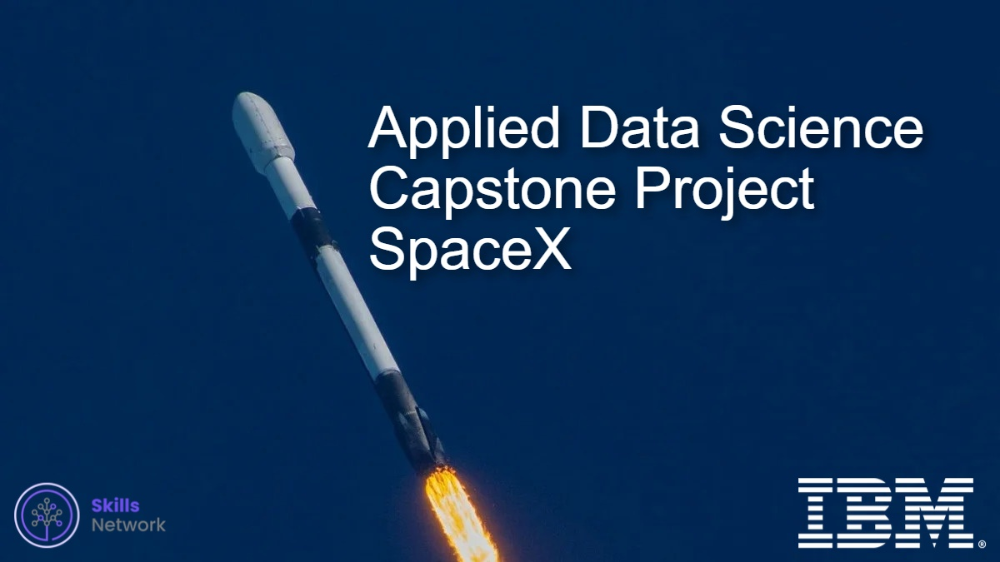

# Applied-Data-Science-Capstone-Project-SpaceX

## Introduction
In this capstone, we will predict if the Falcon 9 first stage will land successfully. SpaceX advertises Falcon 9 rocket launches on its website, with a cost of 62 million dollars; other providers cost upward of 165 million dollars each, much of the savings is because SpaceX can reuse the first stage. Therefore, if we can determine if the first stage will land, we can determine the cost of a launch. This information can be used if an alternate company wants to bid against SpaceX for a rocket launch.
## Overview
- ### Data Collection and Data Wrangling
  We [collect data](SpacexDataCollection.ipynb) on the Falcon 9 first-stage landings. You will use a RESTful API  and [web scraping](/WebScraping.ipynb). You will also convert the data into a dataframe and then perform some [data wrangling](DataWrangling.ipynb).
- ### Exploratory Data Analysis (EDA)
  We perform some [EDA using SQL](SQL_ExploratoryDataAnalysis.ipynb), we also use [data visualization](EDA_data_visualization.ipynb) to visualize the data and extract meaningful patterns to guide the modeling process.
- ### Interactive Visual Analytics and Dashboard
  We build a [dashboard](dashApp.py) to analyze launch records interactively with Plotly Dash. we then build an [interactive map](InteractiveVisualAnalyticsWithFolium.ipynb) to analyze the launch site proximity with Folium.
  
- ### Predictive Analysis and Machine Learning
  We use [machine learning](SpaceX_ML_Prediction.ipynb) to determine if the first stage of Falcon 9 will land successfully. we will split our data into training data and test data to find the best Hyperparameter for SVM, Classification Trees, and Logistic Regression. Then find the method that performs best using test data.
- ### Data-driven Insights Presentation
  we compile all of our activities into one place and deliver our data-driven insights to determine if the first stage of Falcon 9 will land successfully.

## License
MIT

## Acknowledgements
##### © Copyright Coursera Inc. 2022
##### © Copyright IBM Corporation 1994, 2022.
##### © Mohamed Ali Selmi 2022
